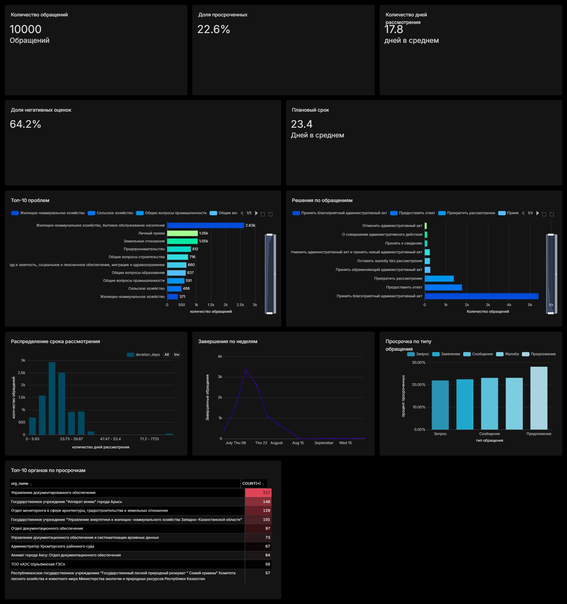
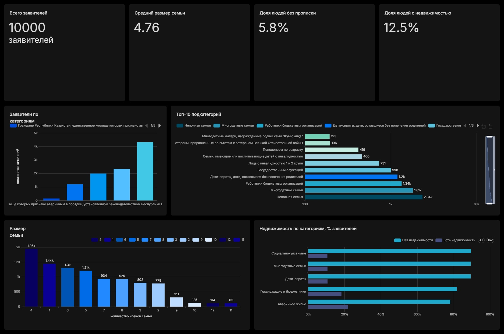
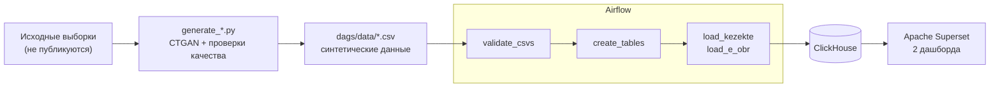

# Qezekte

Аналитический пайплайн на синтетических данных: генерация данных (CTGAN) → проверка качества → загрузка в ClickHouse через Airflow → два дашборда в Apache Superset. Хранилище, оркестрация и BI поднимаются одной командой через Docker Compose.

Учебный проект, выполненный в рамках практики Data Analyst. Он показывает полный аналитический цикл на данных, структура которых повторяет госсистемы.

## О проекте

Государственные информационные системы (обращения граждан, очереди на жильё) содержат персональные данные, с которыми нельзя свободно работать в учебных и демонстрационных целях. Проект решает эту задачу: по структуре реальных выборок CTGAN генерирует синтетические датасеты, которые не содержат реальных записей и идентификаторов.

Затем данные проходят цикл, как с настоящими операционными данными: проверка качества, загрузка в колоночную БД и визуализация.

> **Важно.** CTGAN обучался на небольших выборках (по 100 строк на датасет). Синтетика повторяет структуру и общий вид распределений, но не отражает реальную картину. Цифры на дашбордах демонстрируют методику и не должны использоваться как выводы о реальных процессах.

## Дашборды

Два дашборда в Apache Superset, всего 19 визуализаций.

### Обращения граждан (e_obr), 10 000 записей

KPI: количество обращений, доля просроченных, средний и плановый срок рассмотрения, доля негативных оценок. Графики: топ-10 тем, решения по обращениям, распределение срока рассмотрения, завершения по неделям, просрочка по типу обращения, топ-10 органов по просрочкам.



### Очередь на жильё (kezekte), 10 000 записей

KPI: число заявителей, средний размер семьи, доля без прописки, доля с недвижимостью. Графики: заявители по категориям, топ-10 подкатегорий, размер семьи, недвижимость по категориям.



## Наблюдения по данным

Эти цифры относятся к синтетическим данным и приведены как пример анализа.

- **Просрочено 22.6% обращений:** 20.3% закрыты после дедлайна и 2.3% всё ещё в работе. Метрика учитывает оба статуса: если считать только «Завершено с просрочкой», доля занижается.
- **Средний фактический срок рассмотрения 17.8 дня при плановом 23.4.** В среднем обращения укладываются в норму, но у распределения длинный «хвост» (до 77 дней), который и даёт просрочки.
- **Доля просрочки почти одинакова во всех типах обращений (22–23%).** Заметное отклонение у «Предложений» (~28%) относится к группе из ~100 записей и находится в пределах шума.
- **Самая частая тема обращений ЖКХ** (около 30%). Три главные темы вместе дают около половины всех обращений.
- **64.2% оценок негативные, но оценку оставили лишь ~12% заявителей.** Выборка слишком мала, чтобы судить о качестве работы органов.
- **В очереди преобладают социально-уязвимые слои (43%).** Средний размер семьи 4.76, без прописки 5.8%, недвижимость есть у 12.5% заявителей.

## Качество данных

Сгенерированные CTGAN данные нельзя использовать «как есть». В ходе работы были найдены и исправлены артефакты генерации:

| Проблема | Причина | Решение |
|---|---|---|
| Отрицательный размер семьи (у ~35% записей) | CTGAN моделировал целое число как непрерывное | `CNT_MEM` моделируется как категория |
| 93 уникальных `appeal_id` на 9 180 строк, возможное попадание реальных ID | идентификаторы подавались в модель как категории | ID исключены из обучения и генерируются заново |
| Даты окончания раньше дат начала, заглушки `1970-01-01` | даты моделировались как независимые категории | моделируются длительности, даты вычисляются от `start_dt` |
| Статусы просрочки не совпадали с датами | статус генерировался отдельной колонкой | статус вычисляется по датам |
| Несуществующие пары категория/подкатегория | колонки генерировались независимо | пара склеивается в одну колонку и делится после генерации |
| Слабое обучение на 100 строках | `batch_size=500` даёт 1 шаг обучения за эпоху | размер батча подбирается под размер данных |
| Расхождение KPI просрочки (9.4% против 11.6% на старой версии дашборда) | в метрику не попадали обращения «В работе просрочено» | единое определение: любой статус, кроме «Завершено» |

После генерации скрипты проверяют результат: уникальность ID, отсутствие пересечений с реальными ID, согласованность дат и статусов, валидность пар категорий, сравнение распределений с оригиналом (TVD). Перед загрузкой в ClickHouse данные проверяет ещё и сам DAG.

## Архитектура



Генерация данных запускается отдельно (локально), результат сохраняется в `dags/data/`. Airflow отвечает за проверку и загрузку: DAG `load_synthetic_data_to_clickhouse` последовательно проверяет CSV, пересоздаёт таблицы и параллельно загружает оба датасета. Повторный запуск не создаёт дубликатов.

## Стек технологий

| Категория | Технологии |
|---|---|
| Генерация данных | Python, Pandas, NumPy, CTGAN (PyTorch) |
| Хранилище | ClickHouse |
| Оркестрация | Apache Airflow |
| BI / визуализация | Apache Superset |
| Инфраструктура | Docker, Docker Compose |

## Структура репозитория

```
Qezekte/
├── dags/
│   ├── load_data_dag.py               # DAG Airflow: проверка, создание таблиц, загрузка
│   └── data/                          # синтетические данные (результат генерации)
│       ├── synthetic_e_obr.csv
│       └── synthetic_kezekte.csv
├── images/                            # скриншоты дашбордов для README
├── generate_synthetic_e_obr.py        # генерация синтетики: обращения граждан
├── generate_synthetic_kezekte.py      # генерация синтетики: очередь на жильё
├── dashboard_e_obr.zip                # экспорт дашборда обращений (импорт в Superset)
├── dashboard_kezekte.zip              # экспорт дашборда очереди (импорт в Superset)
├── docker-compose.yml                 # ClickHouse + Superset + Airflow
├── Dockerfile                         # образ Superset с драйвером ClickHouse
├── Dockerfile.airflow                 # образ Airflow с pandas и clickhouse-connect
├── requirements-airflow.txt           # зависимости для образа Airflow
├── .env.example                       # шаблон переменных окружения
└── README.md
```

## Как запустить

**Требования:** Docker и Docker Compose. Готовые синтетические CSV уже лежат в `dags/data/`, поэтому генерацию запускать не обязательно.

### 1. Поднять инфраструктуру

```bash
git clone https://github.com/DanikDaraboz/Qezekte.git
cd Qezekte
cp .env.example .env    # заполнить своими значениями
docker compose up -d --build
```

После запуска:
- **Superset:** [http://localhost:8088](http://localhost:8088)
- **Airflow:** [http://localhost:8081](http://localhost:8081)
- **ClickHouse:** `localhost:8123`

### 2. Загрузить данные

В интерфейсе Airflow включите DAG `load_synthetic_data_to_clickhouse` и запустите его (Trigger DAG). Когда все четыре задачи станут зелёными, таблицы `kezekte_synthetic` и `e_obr_synthetic_data` готовы.

### 3. Импортировать дашборды

В Superset: Settings → Import Dashboards. Загрузите `dashboard_e_obr.zip` и `dashboard_kezekte.zip`. Если Superset запросит пароль к ClickHouse, возьмите его из `.env`. После пересоздания таблиц обновите колонки датасетов (Datasets → Sync columns from source).

### 4. (Необязательно) Сгенерировать данные заново

Для генерации нужны исходные выборки `e_obr.csv` и `kezekte.csv` в корне проекта. Они не публикуются в репозитории, так как это структуры реальных систем. Скрипты можно запустить на любых файлах с той же структурой колонок.

```bash
python -m venv .venv
.venv\Scripts\activate          # Linux/macOS: source .venv/bin/activate
python -m pip install pandas numpy torch ctgan
python generate_synthetic_kezekte.py
python generate_synthetic_e_obr.py
```

Результат сохраняется в `dags/data/`. Запуск воспроизводим (фиксированный seed). Рекомендуется Python 3.10–3.12.

## О приватности данных и ограничениях

- В репозитории публикуются только синтетические данные. Исходные выборки не публикуются, идентификаторы в синтетике генерируются заново и проверяются на отсутствие пересечений с реальными.
- Синтетические данные не гарантируют приватность автоматически: модель может воспроизводить значения из обучающей выборки. Поэтому скрипты считают долю строк, полностью совпавших с исходными, и сравнивают распределения.
- Обучение на 100 строках ограничивает разнообразие: синтетика повторяет структуру исходных записей, но не раскрывает новых закономерностей. Различия между группами на дашбордах (типы обращений, категории очередников) нельзя интерпретировать как реальные.
- Все обращения в синтетике поданы в течение двух дней, поэтому динамики по дате подачи нет.

## Автор

**Данияр Курманбаев**
Data Analyst | [GitHub](https://github.com/DanikDaraboz) | denchikgg2006@gmail.com