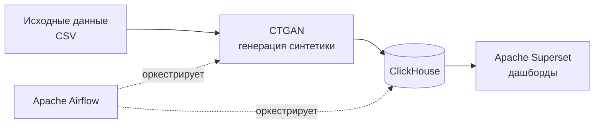
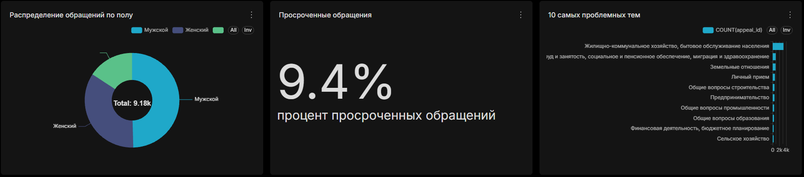
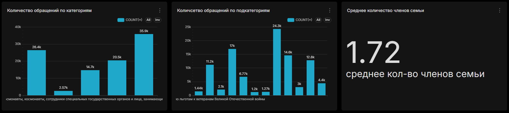
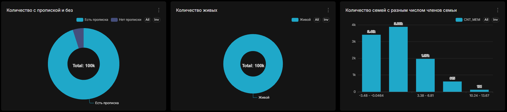

# Qezekte

Аналитический пайплайн на синтетических данных: от сырых CSV до интерактивных дашбордов, полностью в Docker.

Учебный проект, выполненный в рамках практики Data Analyst — демонстрирует end-to-end процесс: генерация приватных синтетических данных → загрузка в аналитическую БД → оркестрация пайплайна → BI-визуализация.

## О проекте

Государственные информационные системы (обращения граждан, очереди на соцподдержку) содержат персональные данные, с которыми нельзя свободно работать в учебных и демо-целях. Проект решает эту задачу: на основе реальной структуры данных через **CTGAN** генерируются синтетические датасеты, которые сохраняют статистические закономерности исходных данных, но не содержат ни одной реальной персональной записи.

Дальше эти данные проходят полный аналитический цикл — загружаются в колоночную БД, оркестрируются через Airflow и визуализируются в Superset, как это происходило бы с реальными операционными данными.

## Что показывает дашборд

Один интерактивный дашборд в Apache Superset, 9 визуализаций на двух датасетах:

**Обращения граждан (e_obr)**
- Количество обращений по категориям и подкатегориям
- Распределение обращений по полу заявителя
- Процент просроченных обращений
- Топ-10 самых проблемных тем

**Очередь на соцподдержку (kezekte)**
- Доля заявителей с пропиской и без
- Соотношение живых/выбывших в очереди
- Распределение семей по количеству членов
- Среднее количество членов семьи

## Архитектура



Весь стек поднимается одной командой через Docker Compose — ClickHouse, Superset и Airflow работают в изолированных контейнерах.

## Стек технологий

| Категория | Технологии |
|---|---|
| Генерация данных | Python, Pandas, CTGAN |
| Хранилище | ClickHouse |
| Оркестрация | Apache Airflow |
| BI / визуализация | Apache Superset |
| Инфраструктура | Docker, Docker Compose |

## Скриншоты

**Обращения граждан**



**Очередь на соцподдержку**




## Структура репозитория

```
Qezekte/
├── dags/                          # DAG'и Airflow для оркестрации пайплайна
├── Dockerfile                     # образ Superset с драйвером ClickHouse
├── Dockerfile.airflow             # образ Airflow с pandas и clickhouse-connect
├── docker-compose.yml             # ClickHouse + Superset + Airflow
├── requirements-airflow.txt       # зависимости для Airflow-образа
├── generate_synthetic_e_obr.py    # генерация синтетики (CTGAN) — обращения граждан
├── generate_synthetic_kezekte.py  # генерация синтетики (CTGAN) — очередь на соцподдержку
├── inspect_e_obr.py                # разведочный анализ исходных данных
├── upload_to_clickhouse.py        # загрузка исходных данных в ClickHouse
├── upload_synthetic.py            # загрузка синтетики (kezekte) в ClickHouse
├── upload_synthetic_e_obr.py      # загрузка синтетики (e_obr) в ClickHouse
├── dashboard.zip                  # экспорт дашборда Superset (для импорта)
├── .env.example                   # шаблон переменных окружения
└── .gitignore
```

## Как запустить

**Требования:** Docker, Docker Compose

```bash
git clone https://github.com/DanikDaraboz/Qezekte.git
cd Qezekte
cp .env.example .env    # заполнить своими значениями
docker compose up -d --build
```

После запуска:
- **Superset** — [http://localhost:8088](http://localhost:8088)
- **Airflow** — [http://localhost:8081](http://localhost:8081)
- **ClickHouse** — `localhost:8123`

Дашборд можно импортировать в Superset из `dashboard.zip` (Settings → Import Dashboards).

## О приватности данных

Все данные, используемые в визуализациях, — **полностью синтетические**, сгенерированы с помощью CTGAN на основе статистической структуры исходных данных. Реальные персональные данные (ФИО, ИИН и т.п.) в репозитории не публикуются и не используются ни на одном из этапов пайплайна.

## Автор

**Данияр Курманбаев**
Data Analyst | [GitHub](https://github.com/DanikDaraboz) | denchikgg2006@gmail.com